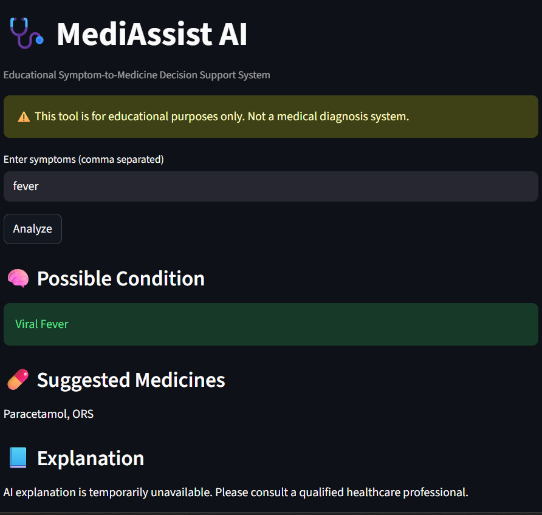
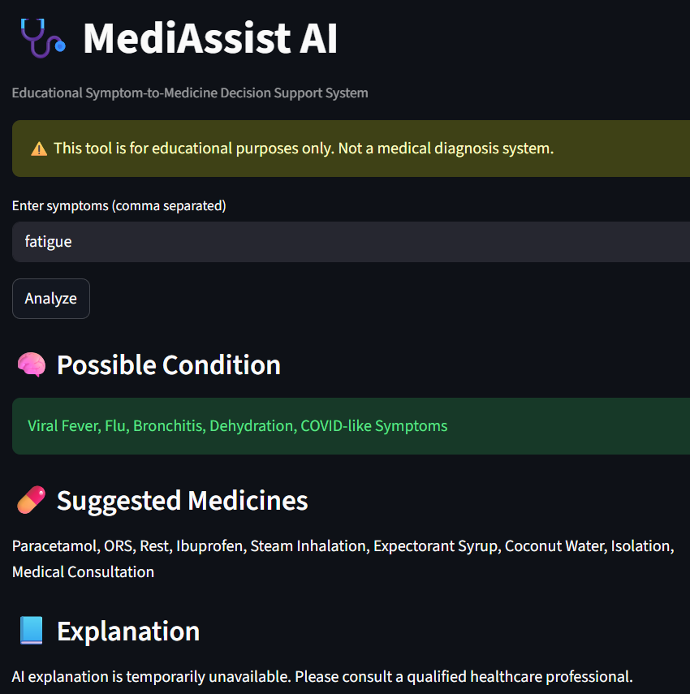

# 🩺 MediAssist AI

MediAssist AI is a Python-based **educational decision-support system**
that accepts user-entered symptoms and suggests possible conditions
along with commonly used medicines, enhanced by Gemini AI explanations.

---

## 🖥️ Application Preview

### 🔹 Streamlit User Interface


### 🔹 Backend API (FastAPI / Swagger)


---

## ⚠️ Disclaimer

This project is created **strictly for learning and demonstration purposes**.  
It does **NOT** provide medical advice, diagnosis, or treatment.  
Always consult a qualified healthcare professional for medical concerns.

---

## 🧠 Features

- Symptom-based condition identification
- Rule-based medicine suggestions
- AI-generated explanations using Gemini
- Safe fallback handling for API failures
- Clean backend–frontend separation

---

## 🛠️ Tech Stack

- Python
- FastAPI
- Streamlit
- Pandas
- Gemini API

---

## ▶️ How to Run the Project

### Backend (FastAPI)
```bash
python -m uvicorn app.main:app --reload
